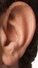
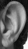
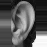
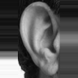
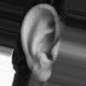
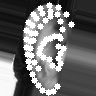
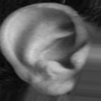

# Employing Fusion of Learned and Handcrafted Features for Unconstrained Ear Recognition
Authors: Earnest E. Hansley, Mauricio Pamplona Segundo, Sudeep Sarkar

Models and demo code for http://arxiv.org/abs/1710.07662

### Models
- Side classifier (75MB): [https://drive.google.com/open?id=17Km_uNnK135w94HlXWXzUW0hYxRj_9-W](https://drive.google.com/open?id=17Km_uNnK135w94HlXWXzUW0hYxRj_9-W)
- Landmark detector (1st stage, 75MB): [https://drive.google.com/open?id=1WhG3Jq5qzYe7hGL-Q_oHcBI_iaxaRPcO](https://drive.google.com/open?id=1WhG3Jq5qzYe7hGL-Q_oHcBI_iaxaRPcO)
- Landmark detector (2nd stage, 75MB): [https://drive.google.com/open?id=12oM0NPmJhDKI_m1GakvTFtV3Uaxk9wUo](https://drive.google.com/open?id=12oM0NPmJhDKI_m1GakvTFtV3Uaxk9wUo)
- CNN descriptor (71MB): [https://drive.google.com/open?id=1BnUX8cVrjYBtpD8ESnwb5b6Wmiuknl3S](https://drive.google.com/open?id=1BnUX8cVrjYBtpD8ESnwb5b6Wmiuknl3S)

### Requirements

This code only requires the master branch of OpenCV to work. You can install it locally with the following sequence of steps without making any modifications in a different OpenCV version previously installed in your system (Ubuntu 16.04):

```
$ sudo apt-get install build-essential
$ sudo apt-get install cmake git libgtk2.0-dev pkg-config libavcodec-dev libavformat-dev libswscale-dev
$ sudo apt-get install python-dev python-numpy libtbb2 libtbb-dev libjpeg-dev libpng-dev libtiff-dev libjasper-dev libdc1394-22-dev
$ cd ~/your_choice/
$ git clone https://github.com/opencv/opencv.git
$ git clone https://github.com/opencv/opencv_contrib.git
$ mkdir opencv_install
$ cd opencv
$ mkdir build
$ cd build
$ cmake -D CMAKE_BUILD_TYPE=Release -D CMAKE_INSTALL_PREFIX=../../opencv_install/ -D OPENCV_EXTRA_MODULES_PATH=../../opencv_contrib/modules/ ..
$ make -j 4
$ make install
```

### Compiling and running

How to compile and run using a local OpenCV installation:

```
$ g++ -std=c++11 demo.cpp -o demo `pkg-config --libs --cflags ~/your_choice/opencv_install/lib/pkgconfig/opencv.pc`
$ export LD_LIBRARY_PATH=~/your_choice/opencv_install/lib/
$ ./demo your_image.{png,jpg,...}
```

### What this demo does?

<table>
  <tr align="center"><td>(1)</td><td>(2)</td><td>(3)</td><td>(4)</td><td>(5)</td><td>(6)</td><td>(7)</td><td>(8)</td></tr>
  <tr align="center">
    <td></td>
    <td></td>
    <td></td>
    <td></td>
    <td></td>
    <td></td>
    <td></td>
    <td></td>
  </tr>
</table>

1. Load an input image
2. Convert image in step #1 to grayscale
3. Normalize the image in step #2 using a coarse parameter estimation
4. Run side classification and flip the image in step #3 horizontally if necessary
5. Detect landmarks in the image in step #4 using 1st stage, which is more robust to pose variations
6. Adjust parameters using landmarks obtained in step #5 and renormalize the image in step #2
7. Detect landmarks in the image of step #6 using 2nd stage, which is more accurate for well normalized images
8. Adjust parameters using landmarks obtained in step #7 and renormalize the image in step #2, then extract a CNN descriptor (output.txt) from the normalized image (output.png)


## Citing

If you find the code in this repository useful in your research, please consider citing:
```
@article{DBLP:journals/corr/abs-1710-07662,
  author    = {Earnest E. Hansley and
               Mauricio Pamplona Segundo and
               Sudeep Sarkar},
  title     = {Employing Fusion of Learned and Handcrafted Features for Unconstrained
               Ear Recognition},
  journal   = {CoRR},
  volume    = {abs/1710.07662},
  year      = {2017},
  url       = {http://arxiv.org/abs/1710.07662},
  archivePrefix = {arXiv},
  eprint    = {1710.07662},
  timestamp = {Wed, 01 Nov 2017 19:05:43 +0100},
  biburl    = {http://dblp.org/rec/bib/journals/corr/abs-1710-07662},
  bibsource = {dblp computer science bibliography, http://dblp.org}
}
```
